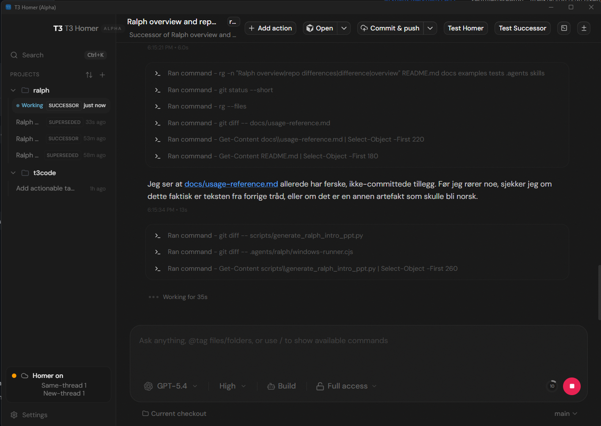

# T3 Homer (WIP)

T3 Homer is a modified **T3 Code** fork focused on reliable long-running agent sessions.



## What Homer Is

Homer is a deterministic server-side supervisor for provider sessions.

- It is not a second chat agent.
- It applies explicit rules when session health degrades.
- It keeps continuation tied to the latest real user intent.
- It is deterministic because session restarts and handoffs must stay predictable, auditable, and resistant to instruction drift.

## How Homer Handles Sessions

Homer follows a strict recovery path:

1. Monitor runtime signals: warnings, errors, compaction, checkpoint outcomes, pending turn timeouts.
2. First recovery path: `restart_in_place` (fresh provider session on the same thread).
3. Escalation path: `spawn_successor_thread` only after repeated restart failures or hard triggers.
4. Carry forward authoritative task state (objective, constraints, non-goals, revision, completion contract).
5. Treat short follow-ups like status/progress/continue as managed continuation, not new assignment.

Result: fewer stuck/looping sessions and less drift between user intent and resumed work.

## What This Fork Adds

- T3 Homer deterministic supervision
- Desktop interface scaling that behaves like a first-class app setting
- Fork-specific desktop identity and data path (`~/.t3-homer`)

## Quick Start

```bash
bun install
bun run start
```

Short run guide: [docs/how-to-run.md](./docs/how-to-run.md)

## Download (Windows)

1. Open [Releases](https://github.com/soolafsen/t3code/releases/latest).
2. Download `T3-Homer-*-x64.exe`.
3. Run the installer.

## Provider Prerequisites

T3 Homer currently supports Codex and Claude.

- Codex: install [Codex CLI](https://github.com/openai/codex), then run `codex login`
- Claude: install Claude Code, then run `claude auth login`

## Credit

Credit where due:

- This project is built on top of upstream **T3 Code** by `pingdotgg`: [github.com/pingdotgg/t3code](https://github.com/pingdotgg/t3code)
- Homer uses Codex ecosystem/runtime integration patterns from OpenAI tooling where relevant.

## Docs

- Fork feature notes: [docs/fork-features.md](./docs/fork-features.md)
- T3 Homer status: [docs/t3homer-status.md](./docs/t3homer-status.md)
- T3 Homer MVP: [docs/t3homer-mvp.md](./docs/t3homer-mvp.md)
- Checkpoint continuity plan: [docs/t3homer-checkpoint-anchored-continuation.md](./docs/t3homer-checkpoint-anchored-continuation.md)
- Observability guide: [docs/observability.md](./docs/observability.md)
- Local fork/sync guide: [docs/local-customization.md](./docs/local-customization.md)

## Contributing

Read [CONTRIBUTING.md](./CONTRIBUTING.md) before opening an issue or PR.
